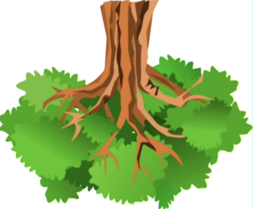
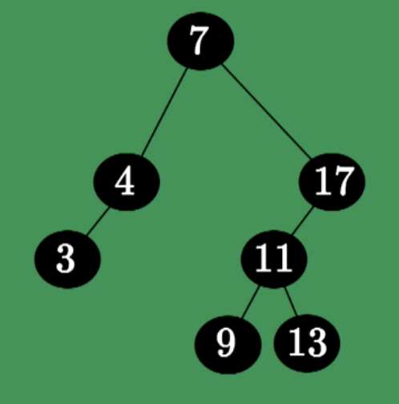
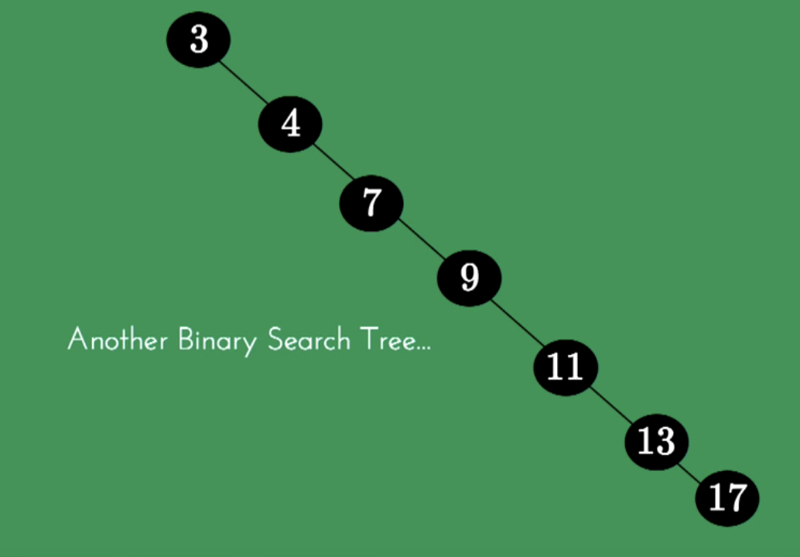
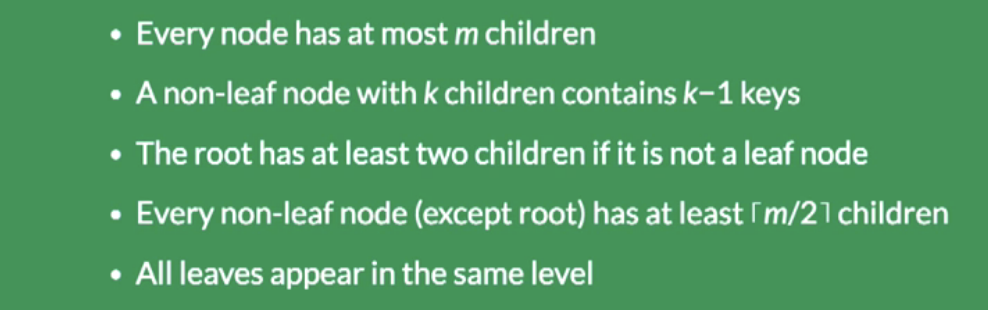
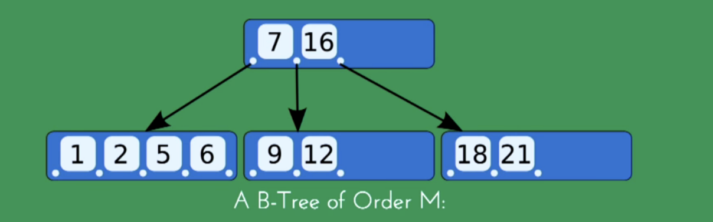

# 数据结构-树
## 前言
理一理基于树模型的数据结构，不理就会因为细小的差异，而搞混。
## 树的种类
- Reverse Tree in Nature

- Binary Search Tree

    - 缺点：O(logN) -> O(N)
    
    - how to solve it ?
    Balanced BST
        - red-black tree
            - definition violation fix rules: 
                - black aunt rotate
                - red aunt color-flip
    
- B-Tree
    - Btree definition
    
    - B-tree-with-order 5
    
    
